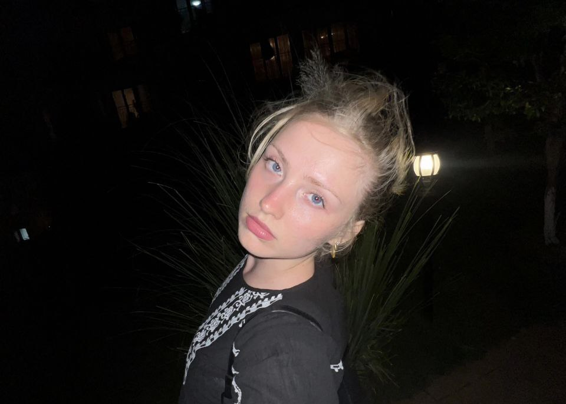

[< back to main page](/ajovt-25-26/)

# ABOUT ME 🐣

###### Hi, I’m Elizabeth. 👋 As a multidisciplinary artist, I work across multiple media and formats, always ready to explore different tools 🛠️ and visual languages to shape relevant outcomes for each project. 💎 I’m especially drawn to concepts driven by experimentation rather than rules ~ bonus points if glue sticks are involved. Let’s make a magic together! 🔮

* I am a **multidisciplinary designer** with a deep love for visual experimentation and creative craft. My journey began with drawing and slowly grew through photography, typography, illustration, motion, and mixed media. Creating has always been my natural language ~ a way to explore, understand, and express the world around me. 👀

* I studied at a multimedia high school, where I discovered the beauty of combining different disciplines. Typography taught me sensitivity to detail, mixed media encouraged curiosity and playfulness with materials, 🎥 filmmaking opened the door to motion and storytelling, etc. All these experiences shaped my way of thinking and allow me to move freely between different mediums today.

* My work often blends digital and analog processes, static and moving images & carefully built systems with intuitive, emotional expression. 👩🏼‍💻 Experience in corporate motion design strengthened my technical precision, while freelancing gives me the freedom to experiment, explore, and follow ideas wherever they lead.

* Outside of design, I find inspiration in traveling, nature trips with friends, animals, and sports. I played tennis 🎾 professionally for seven years, which taught me discipline & persistence. I am naturally creative, constantly creating or thinking about new ideas ~ staying still is not for me.

# 🎪 Let’s make a creative chaos together! 🤹🏻‍♀️

[Want to see more? Here you go](/ajovt-25-26/self-presentation/)👈
