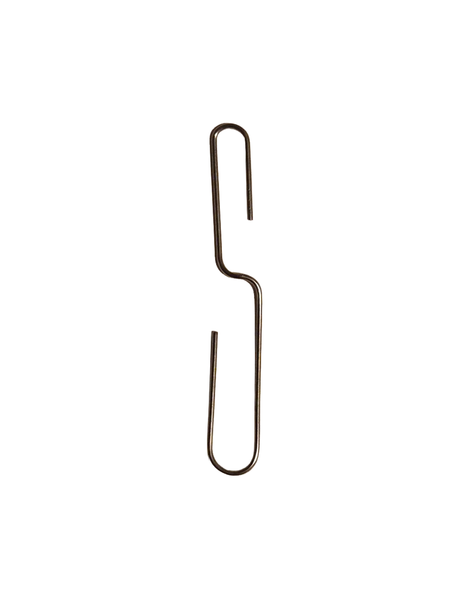
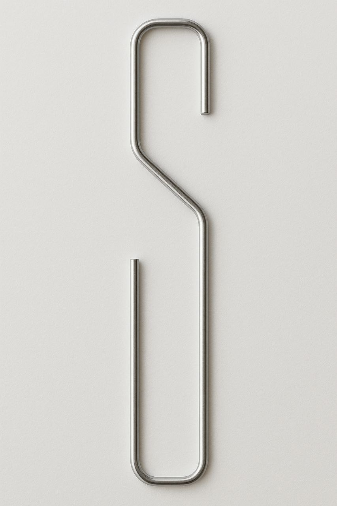
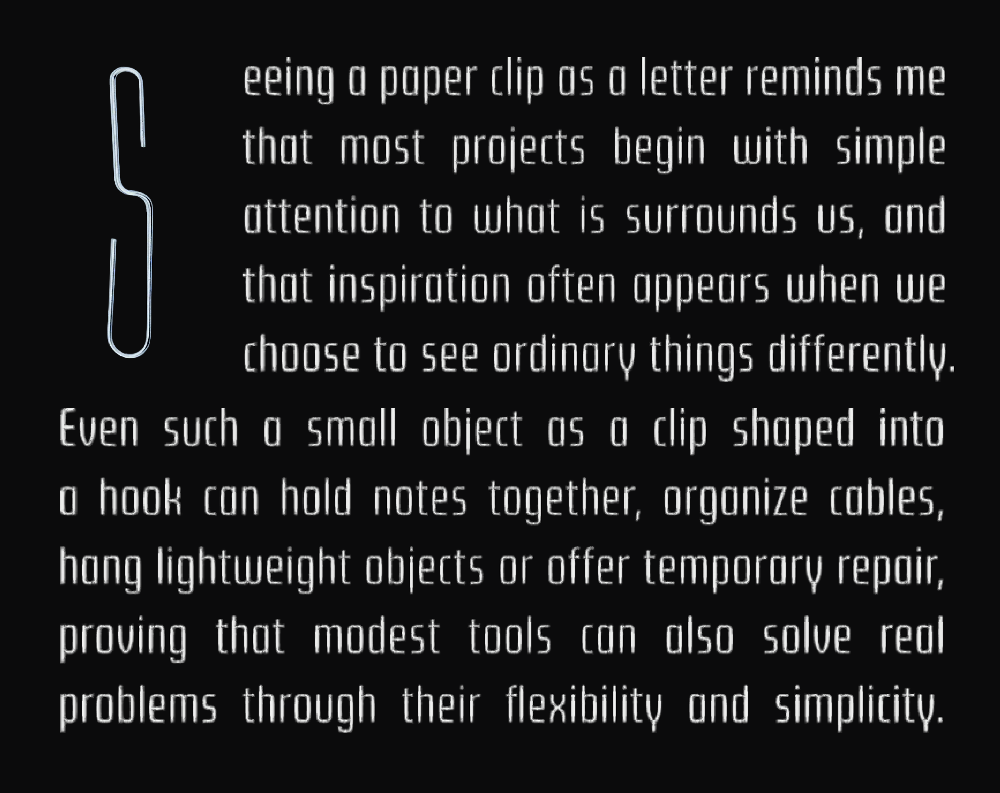
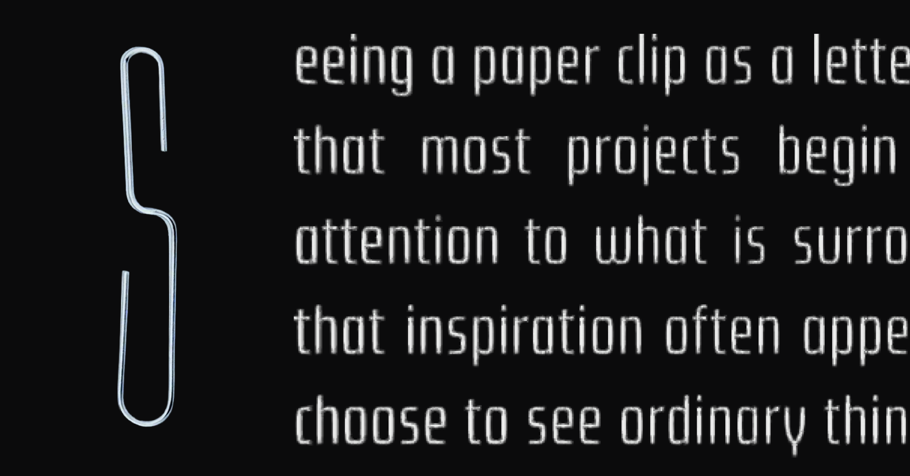
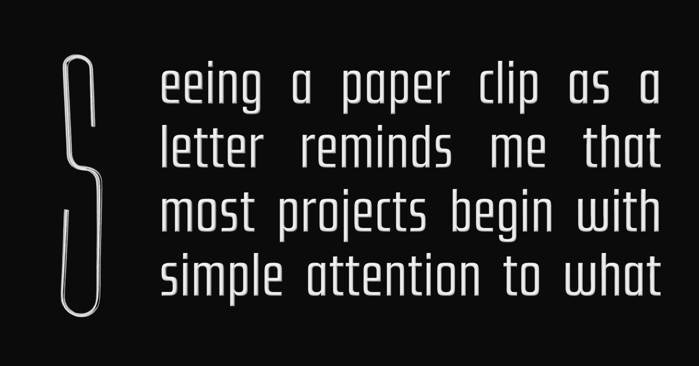
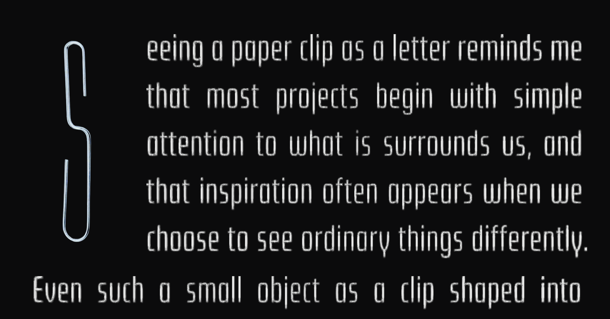

[english-for-designers](../README.md)

# ALT TEXT 💡

This project grew from noticing small things I usually overlook. 👀
By slowing down and working with what was already around me, I began to see how ordinary objects can hold unexpected potential. ✨

##### 2 descriptions without AI (mine):
   * Metal paper clip bent into the letter S form. (44)
    
   * An ordinary, silver wire clip shaped as a letter S, can be used as an universal hook on an everyday base. (105)

 

##### 2 descriptions using AI:
   * A minimalist letter S formed by bending a silver metal paper clip into a smooth, continuous shape. (98)
     
   * A thin, silver paper clip bent into a futuristic letter S, balancing industrial material with typographic form. (111)

##### Final alt text:

   * **A thin silver metal wire bent into the shape of the letter S, combining industrial material with typographic design.** (116)

##### Interactions:

   * Bent paper clip as a letter with S form.
   * Bent paper clip to the letter with S form.
   * Bent metal paper clip to the letter S - form.
   * Bent metal paper clip shaped into the letter S.
   * Metal paper clip bent into the letter S form.
   * An ordinary, metalic wire clip bent as a letter S for an universal everyday usage.
   * An ordinary, silver metalic wire clip shaped as a letter S, can be used as an universal hook on an everyday base.
   * An ordinary, silver wire clip shaped as a letter S, can be used as an universal hook on an everyday base.

##### Metadata:

   * Title: **Seeing Letters In Everyday Objects** (33)
   * Description: **A type experiment showing how simple objects can become letters.** (64)
   * Alt Text: **A thin silver metal wire bent into the shape of the letter S, combining industrial material with typographic design.** (98)

##### Type specimen:

##### Written content:

_"Seeing a paper clip as a letter reminds me that most projects begin with simple attention to what is surrounds us, and that inspiration often appears when we choose to see ordinary things differently. Even such a small object as a clip shaped into a hook can hold notes together, organize cables, hang lightweight objects or offer temporary repair, proving that modest tools can also solve real problems through their flexibility and simplicity."_

##### Preview images + Metadata variantions:

 * Variant 1

   - Title: **Shaping meaning with simple forms** (33)
   - Description: **A type experiment showing how simple objects can become letters.** (64)
   - Alt text: **A letter S made from a bent metal paper clip, shown as a close-up detail on a dark background.** (94)
  

 * Variant 2

   - Title: **Seeing letters in everyday objects** (34)
   - Description: **A type experiment where simple objects become letters.** (54)
   - Alt text: **A metal paper clip bent into the letter S and used as a drop cap next to body text in a simple layout.** (102)
  

 * Variant 3

   - Title: **Small hooks in type design** (26)
   - Description: **This letterform shows how small tools support clear design through simple form.** (79)
   - Alt text: **A sculptural letter S made from a bent paper clip, set into flowing white text on a dark background.** (100)
  

  

### 🫟 CONCLUSION

Through this assignment, I began to see text as an active design tool. Working with alt text and descriptions shifted my focus toward accessibility and showed me how language shapes digital experiences beyond visual form. 🎨
