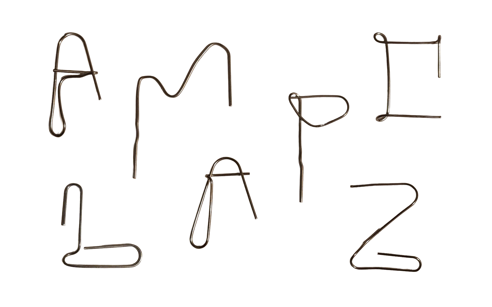

[english-for-designers](../README.md)

# Process of creating my BESPOKE CHARACTER

For our first assignment I created the letter S by using paper clips. 🖇️

#### Main idea

At that period of time I was dealing with a large amount of documentation & paperwork 📑, so paper clips had become my everyday companions in that 'workflow'. One moment ~ a simple thought appeared: _Why not to use them differently?_ Suddenly, the idea and the assignment connected ➡️ the process began.

#### Process

I took individual paper clip and carefully deformed it, one by one 📎, searching for a clear and readable letterform. I tested several variations, but the letter **S** felt the most successful ~ mainly because the original curved shape of the paper clip already carries a similar flow. Rather than forcing the material, I allowed its existing logic to guide the outcome.

#### Result

The final form feels a bit futuristic, resembling an industrial, wire-based typeface or a contemporary techno sans-serif. It is clean, maybe slightly mechanical, but still handmade.👐🏻

#### Conclusion

At first glance the result might seem simple. However, I found that working with a predefined object or shape is more challenging than starting from nothing. Discovering new meaning in an random tool requires observation, patience, and a willingness to see beyond its intended function. 😌 Also it was kinda relaxing, so i would reccomend!
