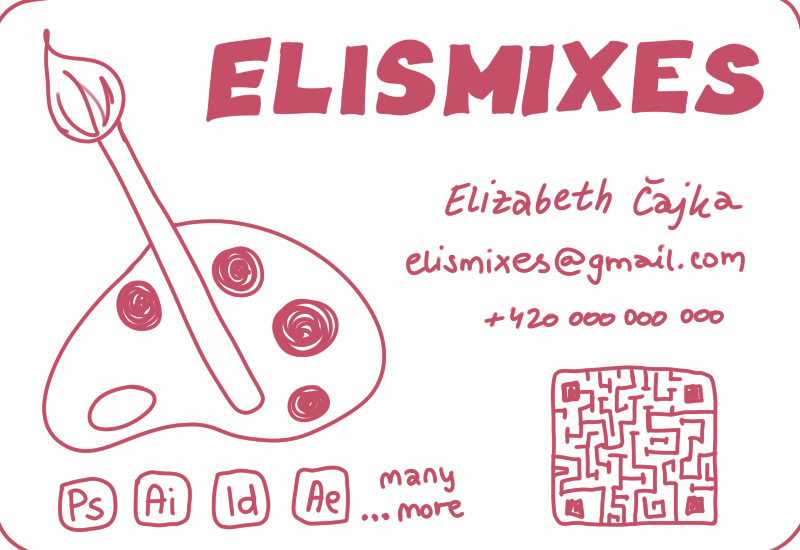
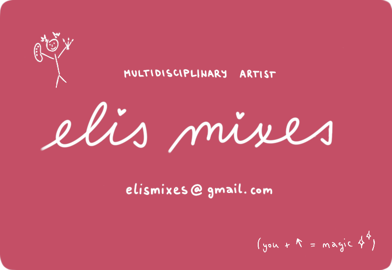

[< back to main page](/ajovt-25-26/)

# BUSINESS CARD 🎀

This assignment gave me a chance to slow down, rethink my decisions, not only visually but also in terms of text ~ how words shape first impressions, influence how a message is felt & how clearly a stranger understands its point. 🥷
Also it reminded me how important text is when presenting _myself and my work_, even in something as small as a business card.

###### I forgot to take a photo of my original business card from class, so I recreated a similar version from memory and then redesigned it again *

### First version

- That first business card was made quickly and very spontaneously. 
At the time, the most important thing for me was that it was pink. I didn’t think much about layout or content, but in my opinion even in that chaos, it reflects a part of who I am and what I want to communicate. But in retrospect, I realize it might NOT be very practical.🙂

### Second version

- This reworked version of my business card took a little more time and intention.
This time I focused more on structure, hierarchy, placement, etc. ~ and of course I chose an all-pink version, because there is never enough pink.🧠
So i decided to place text in the center, removed unnecessary information but allowed myself to include an illustration and extra text ~ without it, the card felt too impersonal. Would I use this card for real clients? ~ maybe no, but really why not...

[My 🤝, your first impression](/ajovt-25-26/handshake/)
