[< back to main page](/ajovt-25-26/)

# CASE STUDY ~ GALERIE KOTELNA 🖼️
###### * Rebranding visual identity, website concept and mobile app design for an art gallery

  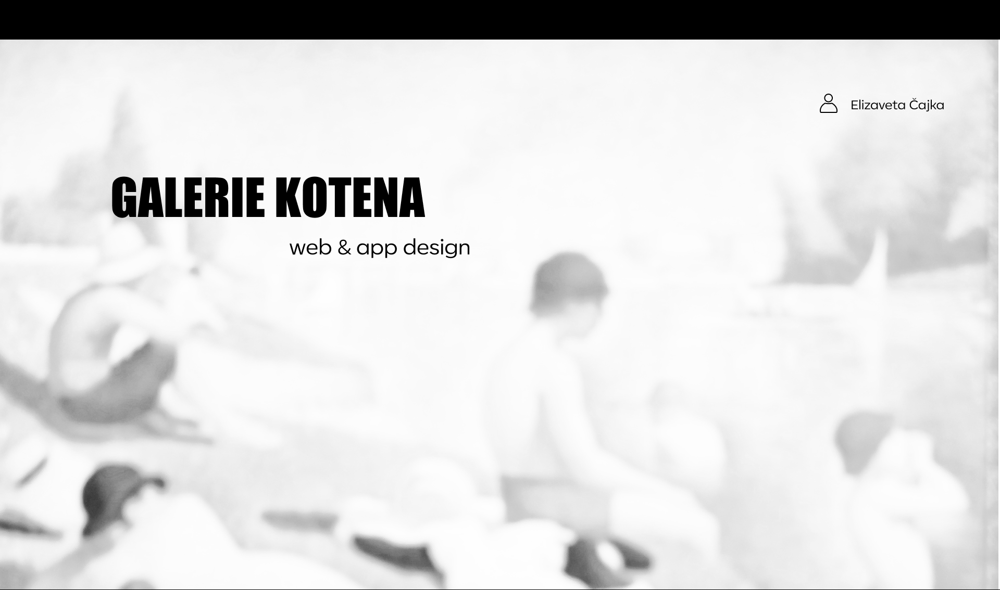

## Overview

Galerie Kotelna is an existing art gallery located in Říčany near Prague. The project began as an exploration of how an established cultural institution could feel more relevant, accessible, and visually engaging for a younger contemporary audience without losing its identity. My goal was to modernize the gallery’s visual communication and extend the refreshed identity into digital platforms ~ first through a redesigned landing page and later through a mobile app concept focused on discovering and purchasing art online.
This project became my first deeper introduction to UX/UI thinking, responsive design systems, and interactive prototyping.

## The Challenge

Although Galerie Kotelna has a strong name and active cultural presence, its current visual outputs felt outdated and visually disconnected from the character of the space itself.

  <video width="500" controls autoplay muted loop playsinline>
    <source src="video/web_GK.mp4" type="video/mp4">
  </video>

Sample of Kotelna gallery landing page.

The gallery is housed in a former boiler room (“Kotelna”), a raw industrial environment with spacious interiors and recognizable architectural details. However, the existing branding and website did not fully communicate that atmosphere.

###### *So my personal challenge was clear:*

- modernize the brand without erasing recognition
- preserve the essence of the original identity (logo)
- create a more engaging digital presence
- attract younger audiences
- translate a physical cultural space into a strong online experience

## My Role

I worked independently on the project from concept to execution.

###### *My responsibilities included:*

- brand analysis
- logo redesign
- visual identity refresh
- website concept design
- UX planning for mobile app
- wireframing
- interface design
- prototyping
- user testing
- presentation of final concept

## Research & Insight

Before designing, I looked at the gallery’s current outputs and asked one central question: What makes Galerie Kotelna unique?

The answer was not only the exhibitions ~ it was the place itself. The name Kotelna references the building’s industrial past. The architecture contains metallic elements, pipe structures, large open rooms, and a raw atmosphere that feels unlike a traditional gallery. This insight shaped the direction of the redesign.

  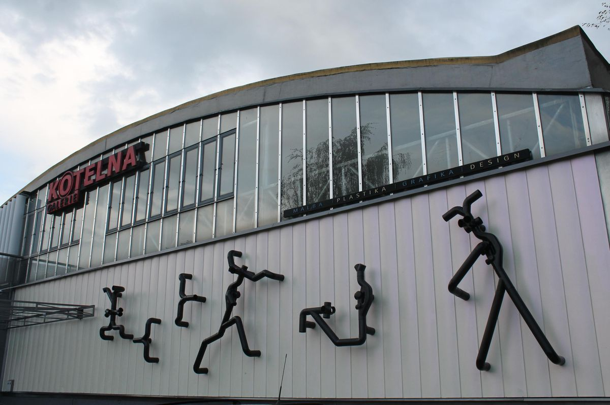
  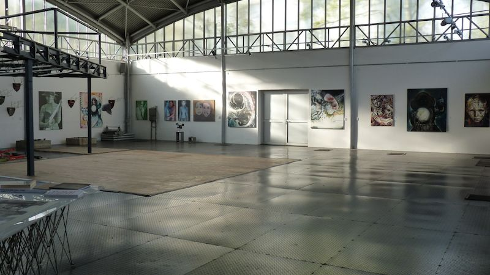

###### *Instead of creating something generic and polished, I wanted the identity to feel:*

- bold
- contemporary
- slightly playful
- structured, but expressive
- inspired by the industrial space itself

## Logo Redesign

The logo became the first and most important step. My intention was not to replace it completely, but to refine and modernize it.

  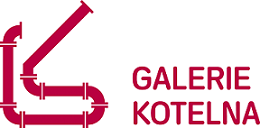

Original gallery logo.

###### *What I changed:*

- simplified the original symbol / brandmark
- removed unnecessary visual details
- preserved the recognizable overall form
- improved clarity and scalability
- updated the wordmark typography to feel cleaner and more breathable

  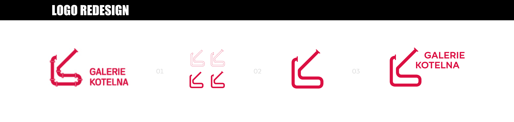

Redesigned gallery logo.

  
###### *Result:*

The new logo keeps continuity with the original identity while feeling fresher, sharper, and more functional across print and digital media.

## Visual Identity System

To support the refreshed logo, I created a simple visual system.

  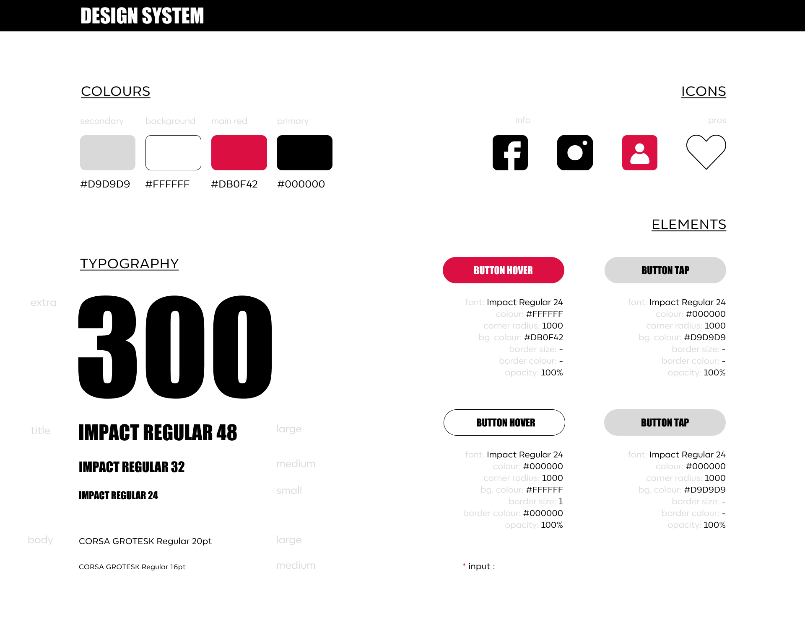

Visual identity system for web.

### Color Palette

I intentionally preserved the gallery’s **strong pink-red tone**, as it already carried recognition and personality 

###### *& complemented it with neutral supporting colors:*

- black
- white
- soft grey tones
  
This allowed artworks themselves to remain visually dominant while the brand color acted as a memorable accent.

### Typography

I selected bold, legible typography with strong hierarchy and contemporary energy.

###### *The system needed to support:*

- headlines
- navigation
- editorial content
- promotional graphics
- digital interfaces

  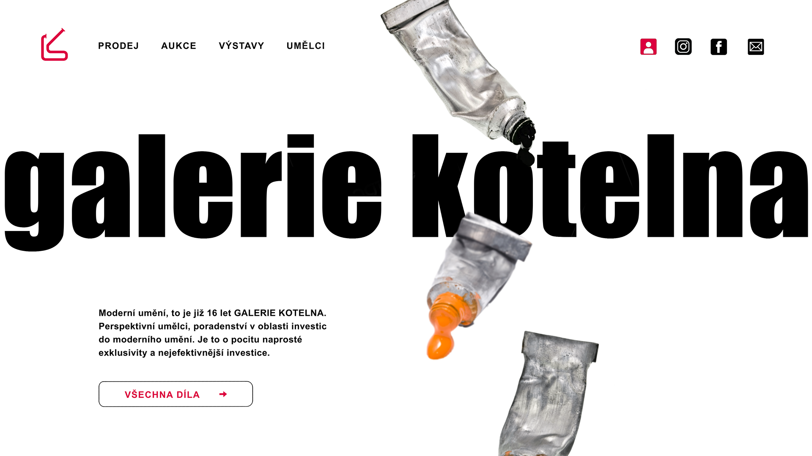

Visually displayed new identity system as a banner for the web.

## Website Concept (first round)

The first phase focused on redesigning the homepage / landing page. I wanted the website to immediately feel different from the existing version ~ something visually confident, memorable, and energetic. Inspired by the pipe structures on the building exterior, I experimented with curved tube-like graphic elements integrated into the layout.

  

Landing page design ~ sketch, wireframe, final design.

The result felt playful and expressive, but after review, one major issue became clear ~ it lacked practical functionality. Although visually interesting, the concept would have been difficult to implement and potentially confusing for users.

This became one of the most valuable moments of the project. Together with my supervisor, we agreed that strong visuals alone were not enough. A successful digital experience must also be realistic, intuitive, and usable. So rather than defending the first concept, I chose to redesign it.

  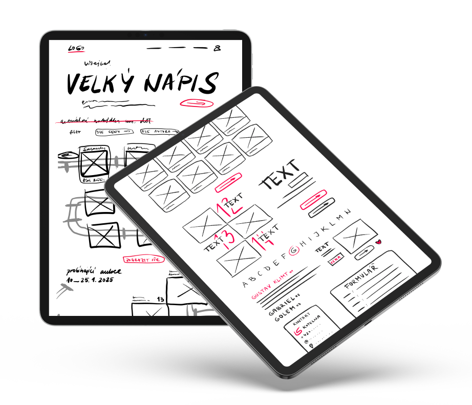

###### *What I kept:*

- energy
- originality
- industrial inspiration
- bold typography

###### *What I changed:*

- reduced decorative pipe elements
- introduced stronger structure and grid logic
- improved hierarchy
- increased focus on artworks themselves
- simplified navigation

  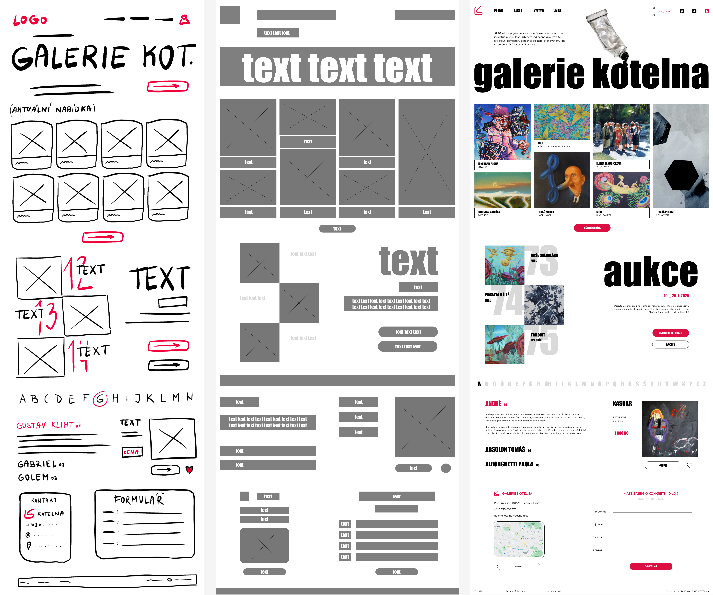

Second & final try of landing page design ~ sketch, wireframe, final design.

  
This second version was approved and became the foundation for the next stage.

  <video width="500" controls autoplay muted loop playsinline>
    <source src="video/web_LP_prototype.mp4" type="video/mp4">
  </video>

Visual prototype of a redesigned landing page for Kotelna gallery.

## Expanding into a mobile app

After finalizing the website direction, I extended the system into a mobile app concept. The main goal was to create a functional and visually cohesive platform.

###### *That would allow users to:*

- browse exhibitions
- discover artworks
- purchase art online
- manage profiles
- stay updated with gallery events

## Visual Identity System

The design system was kept from the previous design so it would stay visually connected to the earlier concept and create a consistent, cohesive look across different media and outputs.

  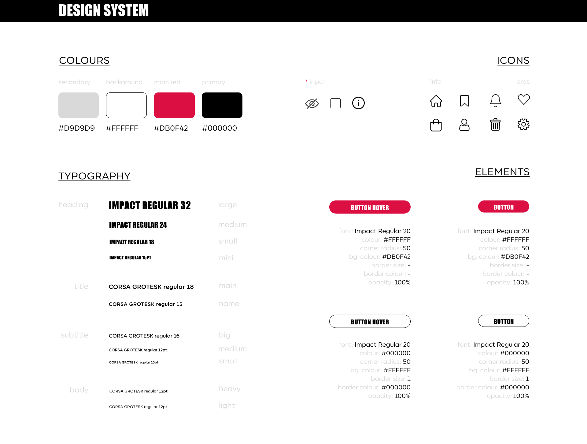

Visual identity system for an app.

## UX Process

Before designing screens, I created supporting strategic tools.

### Value Proposition

  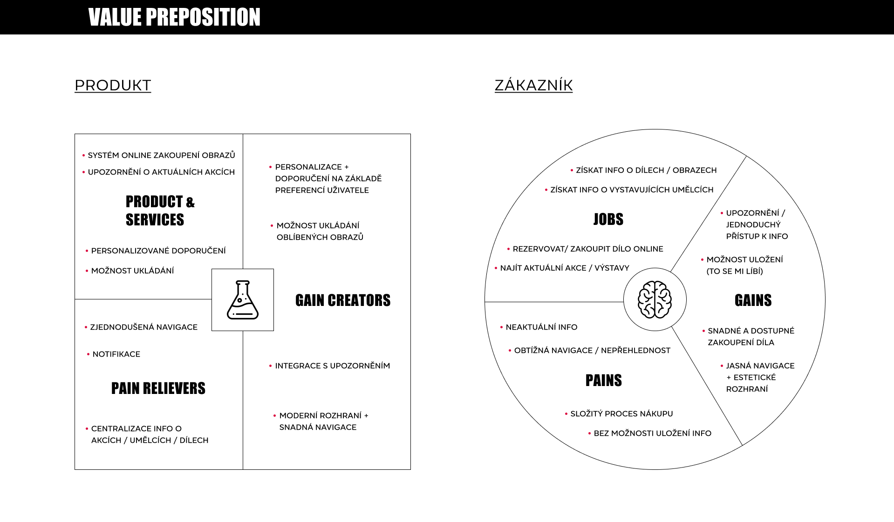

###### *I mapped:*

- user needs
- gallery needs
- opportunities for online sales
- emotional and practical motivations
  
### Flowchart

  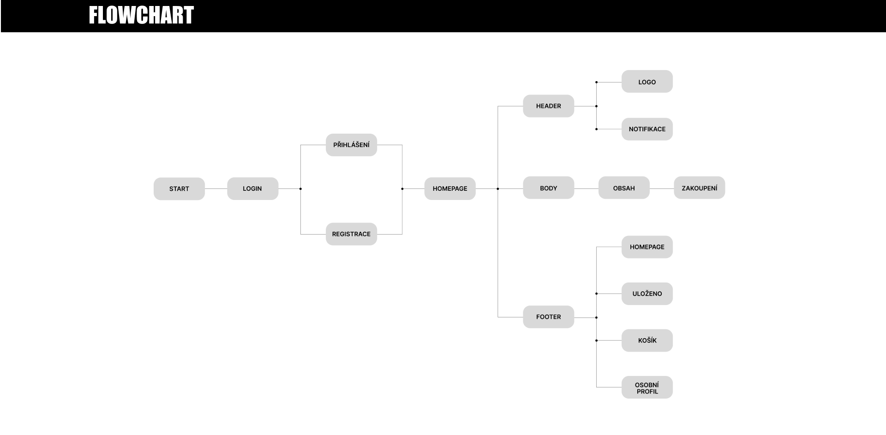

###### *I designed navigation logic showing how users move between:*

- onboarding
- homepage
- categories
- artwork detail
- cart
- profile
- events
  
This helped me organize the app before visual design began.

### Wireframes

  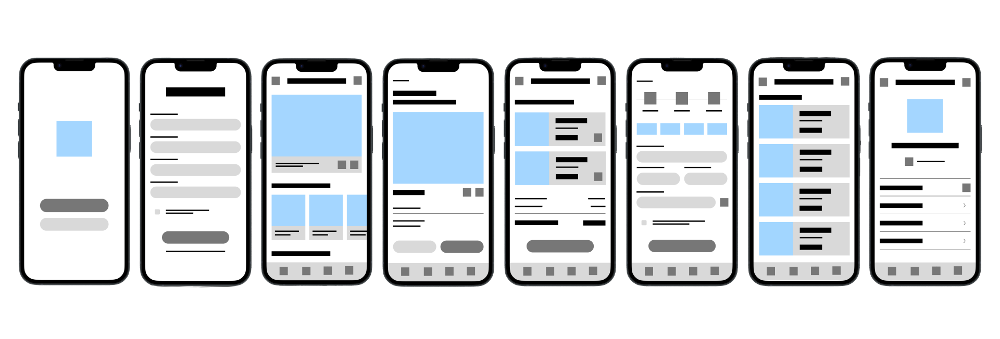

The wireframes allowed me to focus on usability first.

###### *I explored how to make the app:*

- clear
- intuitive
- visually light
- fast to navigate
  
This stage helped solve layout decisions before polishing the interface.

## Final UI Design

  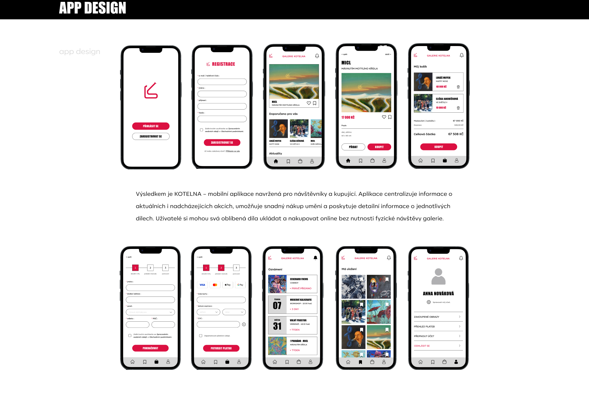

###### *The final mobile interface continued the established brand language:*

- strong typography
- pink-red accent color
- clean neutral backgrounds
- emphasis on artworks
- minimal but expressive controls
  
I also created an interactive prototype to simulate real use.

  <video width="500" controls autoplay muted loop playsinline>
    <source src="video/app_prototype.mp4" type="video/mp4">
  </video>

Visual prototype of an app for Kotelna gallery.

## User Testing

I shared the prototype with friends and close ones to gather feedback.

###### *Negative responses focused on:*

- it's not immediately clear from the introduction what application it is
- no possibility to filter

###### *Positive responses focused on:*

- intuitive navigation
- clean visual style
- easy orientation
- modern overall impression
  
This was especially rewarding because it was my first practical attempt at responsive UI design and prototyping.

## What I Learned

This project became my first real step into UX/UI design. I realized that visual attractiveness alone is never enough. Strong design happens when aesthetics and functionality work together. 

###### *I also learned how valuable it is to:*

- accept valuable feedback
- iterate instead of defending first ideas
- build systems, not only screens
- think from the user’s perspective
- prototype ideas before finalizing them

## Final Reflection

Although I still feel naturally closer to branding, posters, and visual identity work, this project expanded my skillset significantly.
It taught me new tools, new thinking processes, and a more strategic way of designing digital products. Most importantly, it showed me that growth often starts outside your comfort zone.

## Tools Used

- Figma
  
## Outcome

###### *A refreshed visual direction for Galerie Kotelna including:*

- logo redesign
- visual identity system & manual
- homepage concept
- responsive design thinking
- mobile app concept
- interactive prototype
  
## Closing Thought

This project was my attempt to give an existing gallery a more contemporary voice ~ while respecting where it came from.
